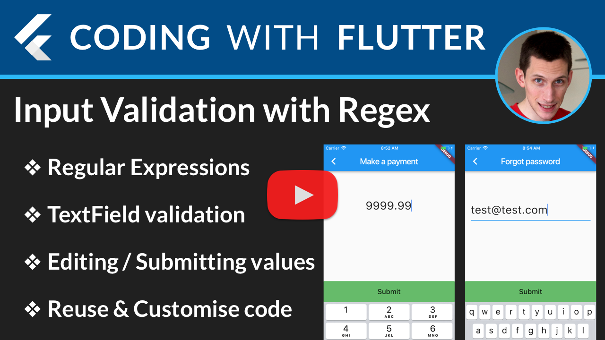

# Flutter: Input Validation with RegExp

Demo project showing how to apply Regex validation to a Flutter [TextField](https://docs.flutter.io/flutter/material/TextField-class.html).

**Full YouTube video walkthrough here:**

## Preview 

Includes t2o sample validators:

- Numeric with 2 decimal digits, max 4 non-decimal digits
- Email validator

--------

Tested with Flutter Beta [0.8.2](https://github.com/flutter/flutter/releases/tag/v0.8.2).

### [License: MIT](LICENSE.md)
