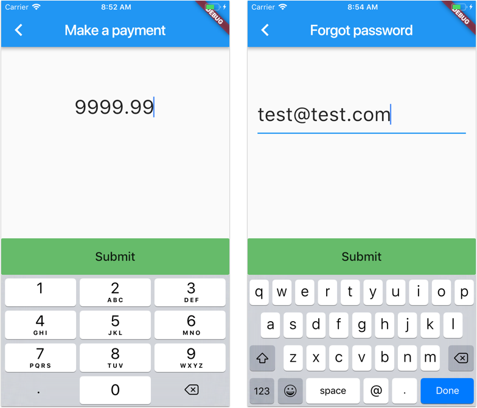

# Flutter: Input Validation with RegExp

Demo project showing how to apply Regex validation to a Flutter [TextField](https://docs.flutter.io/flutter/material/TextField-class.html).

## Preview 

Sample validators:

- Numeric with 2 decimal digits, max 4 non-decimal digits
- Email validator

### [License: MIT](LICENSE.md)
